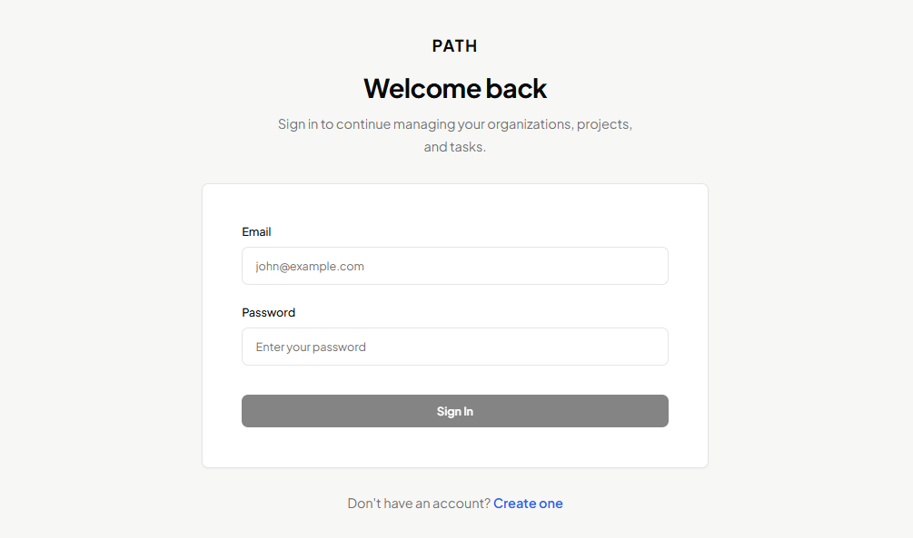
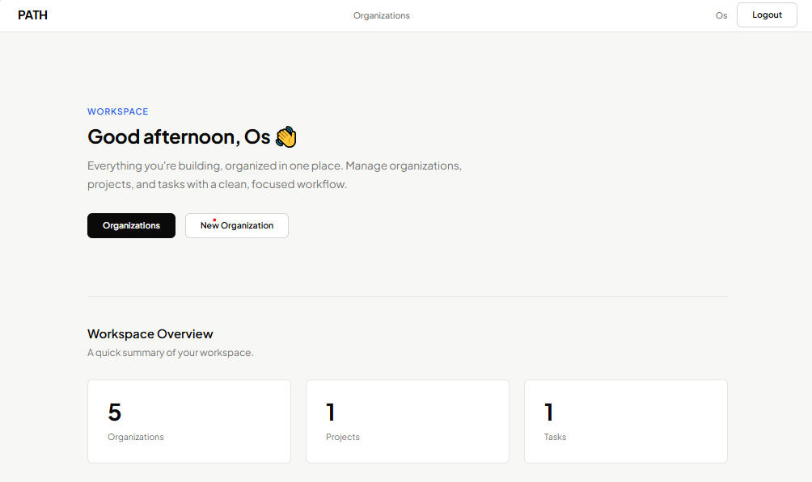
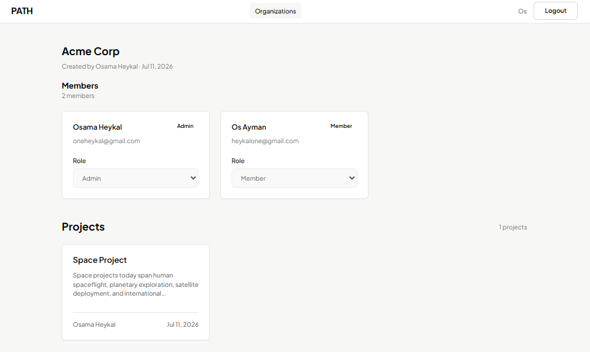
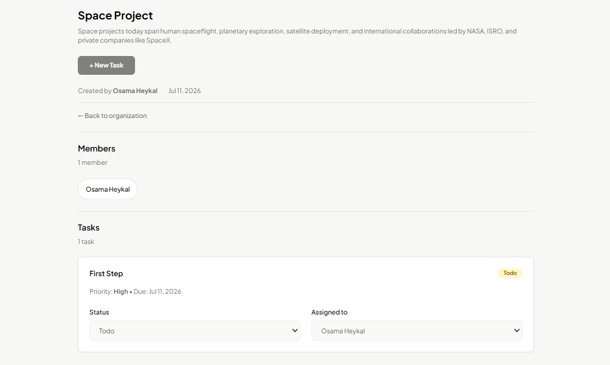

<div align="center">

# 🛤️ PATH

**A full-stack team task management platform with organization-scoped workspaces and role-based access control.**

[](https://1path.vercel.app)
[](https://github.com/1heykal/PATH)

</div>

---

## 📸 Screenshots

<div align="center">




</div>

---

## ✨ Features

| Feature                  | Description                                                                   |
| ------------------------ | ----------------------------------------------------------------------------- |
| 🔐 **Authentication**    | JWT access tokens, HttpOnly cookie refresh tokens, rotation & reuse detection |
| 🏢 **Organizations**     | Users scoped to organizations, admins manage membership                       |
| 🛡️ **Role-Based Access** | Admin, Manager, Member roles enforced backend-wide                            |
| 📋 **Projects**          | Create and manage projects within your organization                           |
| ✅ **Tasks**             | Create, assign, and track tasks with priority and status                      |
| 🚦 **Route Guards**      | Auth, guest, and permission-based guards protecting every route               |

---

## 🛠️ Tech Stack

<div align="center">


</div>

**Backend** — ASP.NET Core Web API, Entity Framework Core, PostgreSQL (production) / SQL Server (dev), JWT auth, Docker

**Frontend** — Angular 18, TypeScript, SCSS, Signals for reactive state, custom HTTP Interceptor for silent token refresh

**Deployment** — Backend on Railway, Frontend on Vercel

---

## 📂 Project Structure

```
PATH/
├── backend/
│   ├── PATH.API/              # Web API, controllers, entry point
│   ├── PATH.Application/      # Business logic, DTOs, exceptions
│   ├── PATH.Domain/           # Entities, enums
│   └── PATH.Infrastructure/   # EF Core, services, DbContext
└── frontend/
    └── PATH.Web/
        └── src/
            └── app/
                ├── core/       # Guards, interceptors, auth service
                ├── features/   # Projects, tasks, organizations, admin
                └── shared/     # Reusable components, models, validators
```

---

## 🚀 Getting Started

### Prerequisites

- .NET 8 SDK
- Node.js 20+
- SQL Server (local dev)

### Backend

```bash
cd backend
dotnet restore
```

Update `appsettings.Development.json`:

```json
{
  "ConnectionStrings": {
    "DefaultConnection": "Your SQL Server connection string"
  },
  "Jwt": {
    "SecretKey": "your-secret-key",
    "Issuer": "your-issuer",
    "Audience": "your-audience"
  }
}
```

```bash
dotnet ef database update
dotnet run --project PATH.API
```

API runs at `https://localhost:7260`

### Frontend

```bash
cd frontend/PATH.Web
npm install
ng serve
```

App runs at `http://localhost:4200`

---

<div align="center">
Built by <a href="https://github.com/1heykal">Osama Heykal</a>
</div>
