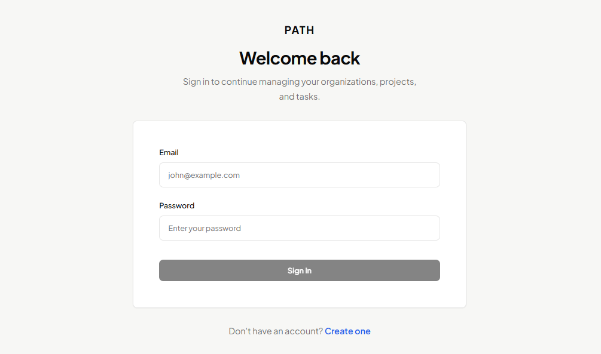
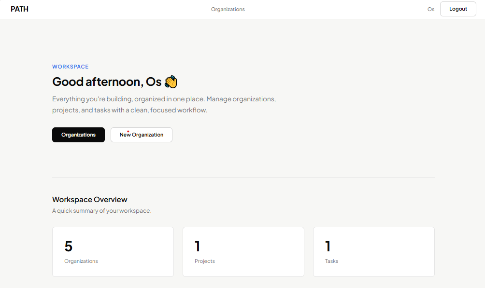
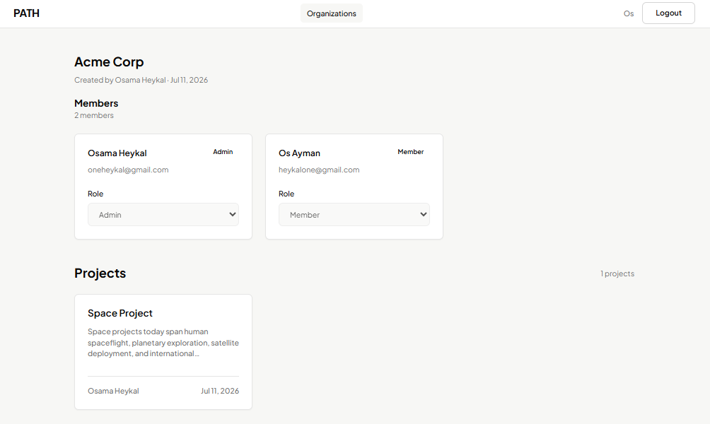
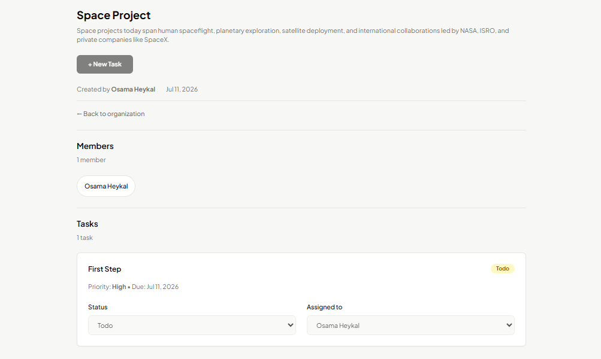

<div align="center">

# 🛤️ PATH

**A full-stack team task management platform with organization-scoped workspaces, secure authentication, role-based access control, automated testing, and continuous integration.**

[](https://github.com/1heykal/PATH/actions/workflows/ci.yml)
[](https://1path.vercel.app)
[](https://github.com/1heykal/PATH)

</div>

---

# 📖 Overview

PATH is a full-stack collaboration platform that helps organizations manage projects and tasks through secure, role-based workspaces.

Built with **ASP.NET Core** and **Angular**, it demonstrates modern backend engineering practices including JWT authentication, refresh token rotation, automated integration testing, Docker, and GitHub Actions CI.

---

# 📸 Screenshots

<div align="center">






</div>

---

# ✨ Features

| Feature                          | Description                                                                          |
| -------------------------------- | ------------------------------------------------------------------------------------ |
| 🔐 **Authentication**            | JWT access tokens with HttpOnly refresh cookies, token rotation, and reuse detection |
| 🏢 **Organizations**             | Organization-scoped workspaces with isolated members and projects                    |
| 🛡️ **Role-Based Authorization** | Admin, Manager, and Member permissions enforced across the application               |
| 📋 **Projects**                  | Create and organize projects inside organizations                                    |
| ✅ **Tasks**                      | Create, assign, update, and delete tasks with priority and status tracking           |
| 🔄 **Silent Authentication**     | Automatic token refresh using Angular HTTP Interceptor                               |
| 🚦 **Route Guards**              | Authentication, guest, and permission-based route protection                         |

---

# 🛠️ Tech Stack

<div align="center">


</div>

### Backend

* ASP.NET Core Web API
* Entity Framework Core
* PostgreSQL (Production)
* SQL Server (Development)
* JWT Authentication
* Refresh Token Rotation & Reuse Detection
* Docker

### Frontend

* Angular 18
* TypeScript
* SCSS
* Angular Signals
* Angular Router
* HTTP Interceptors

### DevOps & Quality

* GitHub Actions
* xUnit
* In-Memory SQLite
* Continuous Integration

---

# 🧪 Testing

PATH includes integration tests covering the application's critical business rules and authorization behavior.

### Covered Scenarios

* Authentication
* Task Creation
* Task Assignment
* Task Status Updates
* Task Deletion
* Authorization Rules

### Testing Stack

* xUnit
* EF Core In-Memory SQLite

Run the test suite:

```bash
cd backend
dotnet test
```

---

# ⚙️ Continuous Integration

Every push and pull request automatically triggers a GitHub Actions workflow that:

* Restores dependencies
* Builds the solution
* Runs the integration test suite

The CI pipeline ensures every commit is automatically validated before being merged.

---

# 🔑 Engineering Highlights

* JWT Authentication with refresh token rotation and reuse detection
* Role-based authorization (Admin, Manager, Member)
* Organization-scoped workspaces
* Integration testing with xUnit and In-Memory SQLite
* Automated CI with GitHub Actions
* Dockerized backend
* Production deployment on Railway and Vercel

---

# 📂 Project Structure

```text
PATH
│
├── backend
│   ├── PATH.API
│   ├── PATH.Application
│   ├── PATH.Domain
│   ├── PATH.Infrastructure
│   ├── PATH.Tests
│   └── PATH.slnx
│
├── frontend
│   └── PATH.Web
│
├── screenshots
│
└── README.md
```

---

# 🚀 Getting Started

## Prerequisites

* .NET 10 SDK
* Node.js 20+
* SQL Server

---

## Backend

```bash
cd backend

dotnet restore

dotnet ef database update

dotnet run --project PATH.API
```

Update `appsettings.Development.json`:

```json
{
  "ConnectionStrings": {
    "DefaultConnection": "YOUR_CONNECTION_STRING"
  },
  "Jwt": {
    "SecretKey": "YOUR_SECRET_KEY",
    "Issuer": "YOUR_ISSUER",
    "Audience": "YOUR_AUDIENCE"
  }
}
```

API:

```
https://localhost:7260
```

---

## Frontend

```bash
cd frontend/PATH.Web

npm install

ng serve
```

Application:

```
http://localhost:4200
```

---

# 🚀 Deployment

| Component | Platform   |
| --------- | ---------- |
| Frontend  | Vercel     |
| Backend   | Railway    |
| Database  | PostgreSQL |

---

<div align="center">

### Built with ❤️ by **Osama Heykal**

**ASP.NET Core • Angular • Full-Stack Developer**

</div>
